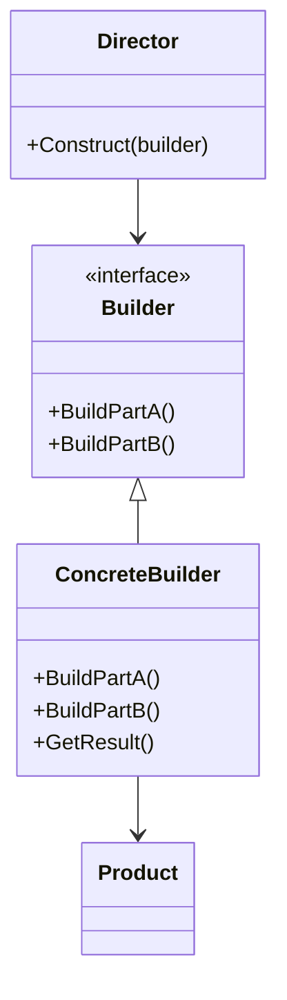

## Строитель (Builder) — шаблон проєктування

**Builder** — це породжуючий шаблон, який інкапсулює створення складного об'єкта та дозволяє розділити процес побудови на етапи.

---

### 🛠 Коли варто використовувати:

* Коли процес створення об'єкта **не повинен залежати** від частин, з яких він складається, і від способу їх поєднання.
* Коли потрібно забезпечити **різні варіації** побудови об'єкта в рамках одного й того ж інтерфейсу.

---

### 📊 Формальна UML-структура:

## Flowcharts



---

### 💻 Приклад на C#:

```csharp
class Product
{
    public List<string> Parts = new();
    public void Show() => Console.WriteLine(string.Join(", ", Parts));
}

abstract class Builder
{
    public abstract void BuildPartA();
    public abstract void BuildPartB();
    public abstract Product GetResult();
}

class ConcreteBuilder : Builder
{
    private readonly Product product = new();

    public override void BuildPartA() => product.Parts.Add("PartA");
    public override void BuildPartB() => product.Parts.Add("PartB");
    public override Product GetResult() => product;
}

class Director
{
    public void Construct(Builder builder)
    {
        builder.BuildPartA();
        builder.BuildPartB();
    }
}

// Використання:
var director = new Director();
var builder = new ConcreteBuilder();
director.Construct(builder);
Product product = builder.GetResult();
product.Show();
```

---

### 👥 Учасники патерна:

* **Product** — представлення створюваного об’єкта. У прикладі: список частин.
* **Builder** — інтерфейс для створення частин об’єкта Product.
* **ConcreteBuilder** — конкретна реалізація Builder, яка створює Product та надає до нього доступ.
* **Director** — розпорядник, який керує порядком викликів методів Builder (опціонально).

---

### 🥗 Приклад застосування (будівництво салату):

```csharp
class Ingredient {
    public string Name;
    public string Amount;
    public override string ToString() => $"{Amount} {Name}";
}

class Salad
{
    public string Name { get; set; }
    public List<Ingredient> Ingredients { get; } = new();
    public void Show() {
        Console.WriteLine($"Салат: {Name}");
        foreach (var i in Ingredients) Console.WriteLine($"- {i}");
    }
}

class SaladBuilder
{
    private readonly Salad salad = new();

    public SaladBuilder Named(string name) { salad.Name = name; return this; }
    public SaladBuilder Add(string name, string amount)
    {
        salad.Ingredients.Add(new Ingredient { Name = name, Amount = amount });
        return this;
    }
    public SaladBuilder AddTomato(int g) => Add("помідори", $"{g} г");
    public SaladBuilder AddCucumber(int g) => Add("огірки", $"{g} г");
    public SaladBuilder AddOil(string amt) => Add("оливкова олія", amt);
    public SaladBuilder AddSalt(string amt) => Add("сіль", amt);
    public Salad Build() => salad;
}

var salad = new SaladBuilder()
    .Named("Цезарь")
    .AddTomato(150)
    .AddCucumber(100)
    .AddOil("2 ст. ложки")
    .AddSalt("дрібка")
    .Build();

salad.Show();
```

---

### ✅ Переваги:

* Гнучкість створення складних об’єктів.
* Ізоляція логіки побудови від структури.
* Можливість створення різних варіацій об'єкта без зміни клієнтського коду.

### ⚠️ Недоліки:

* Більше класів у структурі.
* Для простих об’єктів — надмірна складність.

> 🔸 **Director — не обов'язковий.** Його слід додавати лише у випадках, коли будівництво об’єкта повторюється або має фіксовану логіку.

---

🔚 У підсумку, патерн Builder — це зручний спосіб створювати складні об’єкти крок за кроком, не перевантажуючи конструктори й не порушуючи принципів SOLID.
