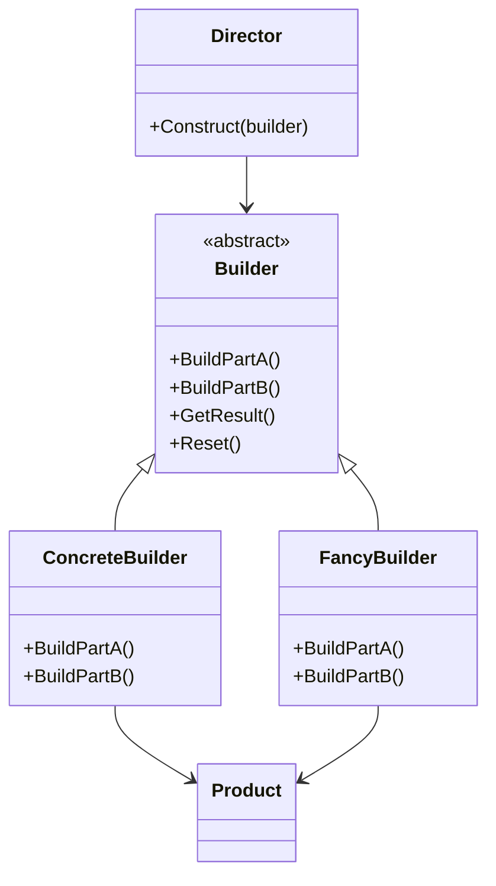

## Будівельник (Builder) — шаблон проєктування

**Builder** — це породжуючий шаблон, який інкапсулює створення складного об'єкта та дозволяє розділити процес побудови на етапи.

---

### 🛠 Коли варто використовувати:

* Коли процес створення об'єкта **не повинен залежати** від частин, з яких він складається, і від способу їх поєднання.
* Коли потрібно забезпечити **різні варіації** побудови об'єкта в рамках одного й того ж інтерфейсу.

---

### 📊 Формальна UML-структура:



---

### 💻 Приклад на C#:

```csharp
class Product
{
    public List<string> Parts = new();
    public void Show() => Console.WriteLine(string.Join(", ", Parts));
}

abstract class Builder
{
    protected Product product = new();

    public abstract void BuildPartA();
    public abstract void BuildPartB();

    public virtual Product GetResult() => product;
    public virtual void Reset() => product = new();
}

class ConcreteBuilder : Builder
{
    public override void BuildPartA() => product.Parts.Add("PartA");
    public override void BuildPartB() => product.Parts.Add("PartB");
}

class FancyBuilder : Builder
{
    public override void BuildPartA() => product.Parts.Add("🌟 Шикарна частина A");
    public override void BuildPartB() => product.Parts.Add("✨ Шикарна частина B");
}

class Director
{
    public void Construct(Builder builder)
    {
        builder.Reset();
        builder.BuildPartA();
        builder.BuildPartB();
    }
}

// Використання:
var director = new Director();
var builder = new ConcreteBuilder();
director.Construct(builder);
Product product = builder.GetResult();
product.Show();

var fancyBuilder = new FancyBuilder();
director.Construct(fancyBuilder);
Product fancyProduct = fancyBuilder.GetResult();
fancyProduct.Show();
```

---

### 👥 Учасники патерна:

* **Product** — представлення створюваного об’єкта. У прикладі: список частин.
* **Builder** — інтерфейс для створення частин об’єкта Product.
* **ConcreteBuilder** — конкретна реалізація Builder, яка створює Product та надає до нього доступ.
* **Director** — розпорядник, який керує порядком викликів методів Builder (опціонально).

> 🔸 **Director — не обов'язковий.** Його слід додавати лише у випадках, коли будівництво об’єкта повторюється або має фіксовану логіку.

---

### 🥗 Приклад застосування (будівництво салату):

```csharp
class Ingredient {
    public string Name;
    public string Amount;
    public override string ToString() => $"{Amount} {Name}";
}

class Salad
{
    public string Name { get; set; }
    public List<Ingredient> Ingredients { get; } = new();
    public void Show() {
        Console.WriteLine($"Салат: {Name}");
        foreach (var i in Ingredients) Console.WriteLine($"- {i}");
    }
}

class SaladBuilder
{
    private readonly Salad salad = new();

    public SaladBuilder Named(string name) { salad.Name = name; return this; }
    public SaladBuilder Add(string name, string amount)
    {
        salad.Ingredients.Add(new Ingredient { Name = name, Amount = amount });
        return this;
    }
    public SaladBuilder AddTomato(int g) => Add("помідори", $"{g} г");
    public SaladBuilder AddCucumber(int g) => Add("огірки", $"{g} г");
    public SaladBuilder AddOil(string amt) => Add("оливкова олія", amt);
    public SaladBuilder AddSalt(string amt) => Add("сіль", amt);
    public Salad Build() => salad;
}

var salad = new SaladBuilder()
    .Named("Цезарь")
    .AddTomato(150)
    .AddCucumber(100)
    .AddOil("2 ст. ложки")
    .AddSalt("дрібка")
    .Build();

salad.Show();
```

---

### 🔁 Fluent chaining та Director

* **Fluent chaining** — це стиль, у якому методи повертають сам об’єкт, дозволяючи будувати ланцюжок викликів. Він добре підходить для читабельного конфігурування об'єктів:

```csharp
var salad = new SaladBuilder()
    .Named("Літній салат")
    .AddTomato(100)
    .AddCucumber(80)
    .AddOil("1 ст. ложка")
    .Build();
```

* **Director** — корисний, коли потрібно стандартизувати або повторно використовувати шаблони побудови:

```csharp
class SaladDirector
{
    public Salad MakeCaesar(SaladBuilder builder) =>
        builder.Named("Цезарь")
               .AddTomato(150)
               .AddCucumber(100)
               .AddOil("2 ст. ложки")
               .AddSalt("дрібка")
               .Build();
}
```

> Fluent chaining і Director можуть використовуватись окремо або разом, залежно від потреб архітектури.

---

### 🔧 Рекомендації щодо використання:

🟢 **Використовуйте Fluent chaining, якщо:**

* Вам потрібна гнучкість або нестандартні кроки побудови
* Ви цінуєте читабельність
* Клієнт безпосередньо керує побудовою об'єкта

🟦 **Використовуйте Director, якщо:**

* Вам потрібно забезпечити стандартизовану побудову
* Логіка побудови складна і її слід інкапсулювати

➡️ У більшості сучасних C#-додатків **Fluent Builder** виглядає інтуїтивніше та читається краще.
🔹 Однак, при потребі зручно мати **Director** як опціональний інструмент для повторного використання шаблонів.

---

---

### ❓ Чому використовують `abstract class Builder`, а не `interface`?

* Абстрактний клас дозволяє **зберігати стан**, наприклад, створюваний об'єкт (`Product`).
* Можна **реалізувати спільну логіку** (наприклад, `GetResult()` або `Reset()`) один раз у базовому класі.
* Підтримує **protected методи**, які можна використовувати у підкласах, але не виносити назовні.
* Підтримка **часткової реалізації**: можна частину методів реалізувати, а інші залишити абстрактними.
* Інтерфейс — лише контракт. Абстрактний клас — це і контракт, і часткова реалізація.

> 🔹 Якщо логіки в базовому класі немає, а лише контракт — тоді можна використовувати інтерфейс. Але у патерні Builder часто потрібен стан і логіка — тому абстрактний клас більш доречний.

---

На завершення, підсумуймо основні плюси й мінуси патерну Builder.

### ✅ Переваги:

Використання шаблону Builder дає такі переваги:

* **Гнучкість** — дає змогу поетапно створювати об'єкти з різною конфігурацією.
* **Ізоляція логіки побудови** — створення об’єкта не залежить від його частин та порядку складання.
* **Масштабованість** — легко додавати нові типи побудови без зміни існуючого коду.
* **Зрозумілий API** — завдяки fluent chaining інтерфейс побудови виглядає читаємо та інтуїтивно.

### ⚠️ Недоліки:

* Більше класів у структурі.
* Для простих об’єктів — надмірна складність.

🔚 У підсумку, патерн Builder — це зручний спосіб створювати складні об’єкти крок за кроком, не перевантажуючи конструктори й не порушуючи принципів SOLID.
