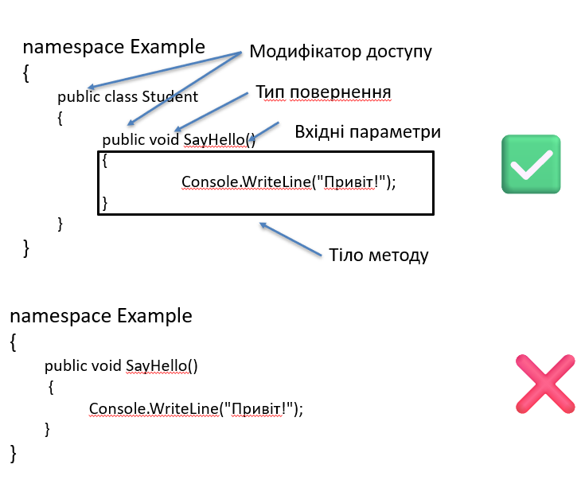

У C# типи можуть містити різні члени, які визначають їхню структуру та поведінку:

- Поля (Fields)
- Методи (Methods)
- Властивості (Properties)
- Події (Events)
- Конструктори (Constructors)
- Деструктори (Destructors або фіналізатори)

---

## Поля (Fields)

**Поле** – це змінна, оголошена всередині класу або структури, яка зберігає стан об’єкта.

```csharp
class Student
{
    public int age; // поле
}
```

## Методи (Methods)

**Метод** – це іменований блок коду в класі або структурі, який визначає набір інструкцій для виконання певної дії або обчислення.

**Загальна схема:**

```csharp
[модифікатор доступу] [тип повернення] НазваМетоду([параметри])
{
    // тіло методу
}
```

* **Тип повернення** – що повертає метод (`int`, `string`, `void`).
* **НазваМетоду** – прийнято писати з великої літери (`SayHello`).
* **Параметри** – у круглих дужках, можуть бути відсутні.
* **Тіло методу** – блок `{ }` з кодом.

**Приклад:**

```csharp
namespace Example
{
    public class Student
    {
        public void SayHello()
        {
            Console.WriteLine("Привіт!");
        }
    }
}
```

✅ Правильно: метод оголошено в класі.
❌ Неправильно: метод оголошено поза класом.



---

## Властивості (Properties)

**Властивість (property)** – це спеціальний член класу, який поєднує в собі два методи доступу: `get` (читання значення) та `set` (зміна значення). Завдяки властивостям код стає компактним і зрозумілим, оскільки вони дозволяють працювати з полями як зі звичайними змінними, але з можливістю додаткової логіки.

**Класичний доступ через методи**

```csharp
public class Student
{
    private int _age;

    public void SetAge(int value)
    {
        _age = value;
    }

    public int GetAge()
    {
        return _age;
    }
}
```

**Повна властивість (Full Property)**

```csharp
public class Student
{
    private int _age;

    public int Age
    {
        get { return _age; }
        set { _age = value; }
    }
}
```

**Автовластивість (Auto-Property)**

```csharp
public class Student
{
    public int Age { get; set; }
}
```

📌 Автовластивість використовується, коли додаткової логіки у `get` чи `set` не потрібно.

**Використання:**

```csharp
var student1 = new StudentWithMethods();
student1.SetAge(20);
Console.WriteLine(student1.GetAge());

var student2 = new StudentWithProperty();
student2.Age = 20;
Console.WriteLine(student2.Age);
```


---

## Події (Events)

**Подія (event)** – спеціальний член, який дозволяє класу повідомляти інші об’єкти про певну дію.

```csharp
class Student
{
    public event Action ExamPassed;
}
```

---

## Конструктори (Constructors)

**Конструктор** – спеціальний метод, який автоматично викликається при створенні об’єкта для ініціалізації стану.

**Особливості конструкторів:**

* Назва конструктора збігається з назвою класу.
* Не мають типу повернення (навіть `void`).
* Можуть мати параметри для початкової ініціалізації.
* Конструкторів може бути декілька (це називається перевантаження конструкторів).
* Якщо конструктор не визначений явно – компілятор додає конструктор за замовчуванням(крнструктор без параметрів).

```csharp
class Student
{
    public string Name { get; set; }

    // Конструктор з параметром
    public Student(string name)
    {
        Name = name;
    }

    // Конструктор за замовчуванням
    public Student()
    {
        Name = "Невідомий";
    }
}
```

---

## Деструктори (Destructors)

**Деструктор (фіналізатор)** – спеціальний метод, який викликається перед знищенням об’єкта збирачем сміття.
Використовується для очищення ресурсів.

**Особливості деструкторів:**

* Назва деструктора збігається з назвою класу, але перед нею ставиться символ `~`.
* Не мають параметрів.
* Не мають модифікаторів доступу та типу повернення.
* Використовуються рідко, головним чином для звільнення некерованих ресурсів.
* Виклик деструктора не гарантується в конкретний момент часу – його викликає спеціальна програма, яка називається збирач сміття (GC).

```csharp
class Student
{
    ~Student()
    {
        // очищення ресурсів
    }
}
```

---
