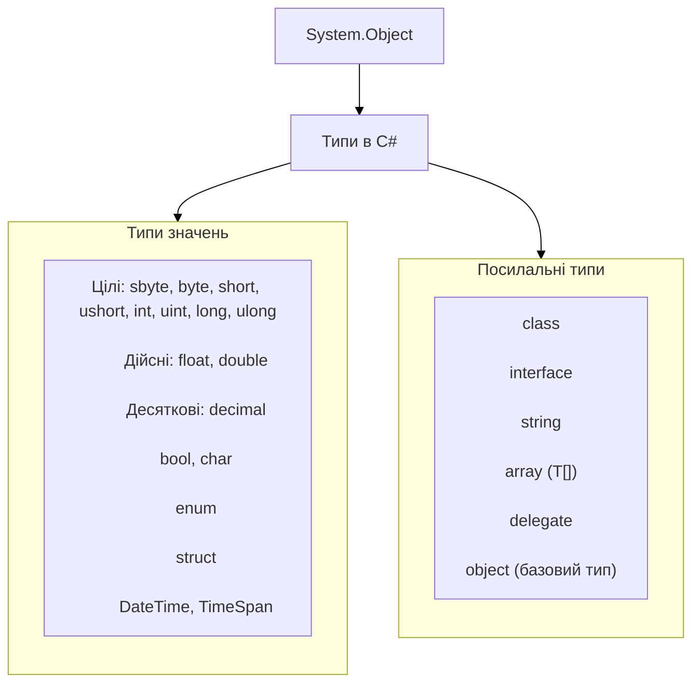

У C# **тип** визначає:

* які значення може зберігати змінна;
* які операції над ними можливі;
* скільки пам’яті потрібно;
* де зберігаються дані (у стеку чи в керованій кучі).

---

### 📊 UML-структура типів у C#:

---

### Опис груп

**Типи значень**

* Зберігають дані безпосередньо у стеку.
* При присвоєнні створюється копія значення.
* Приклади: `int`, `double`, `decimal`, `bool`, `char`, `DateTime`.

**Посилальні типи**

* Зберігають посилання на дані у керованій кучі.
* При присвоєнні копіюється лише посилання, а не сам об’єкт.
* Приклади: `class`, `string`, `array`, `delegate`.

**Спеціальні типи**

* `object` – базовий для всіх типів.
* `dynamic` – визначається під час виконання.
* `var` – виведення типу компілятором.
* `Nullable` (`int?`, `double?`) – дозволяють значенням мати `null`.
